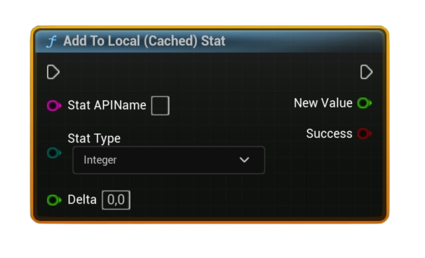

# Add To Local (Cached) Stat

Adds a **Delta** to a numeric user stat in the <b>local Steam cache</b>. Supports <b>Integer</b> and <b>Float</b> stats. Persist later with <b>Store User Stats &amp; Achievements</b>.

#### Inputs
| `Pin` | `Type` | `Description` |
| --- | --- | --- |
| `Stat API Name` | `String` | Exact stat identifier defined in Steamworks (e.g., `ST_KILLS`). |
| `Stat Type` | `Enum (Integer / Float)` | The numeric stat kind to modify. *(Average is not supported here.)* |
| `Delta` | `float` | Amount to add. For **Integer** stats, this is truncated to `int32` before applying. |

#### Outputs
| `Pin` | `Type` | `Description` |
| --- | --- | --- |
| `New Value` | `float` | The new value after addition. (Integer stats are reported as a float here.) |
| `Success` | `Bool` | `true` if the local cache was updated. |

<h3><b>Notes</b></h3>
<ul style="font-size:0.72rem; line-height:1.75">
  <li>Call <b>Request Current Stats And Achievements</b> once before using stat nodes (initializes local cache).</li>
  <li>This updates the <b>local</b> Steam cache only—persist with <b>Store User Stats &amp; Achievements</b>.</li>
  <li>Supports <b>Integer</b> and <b>Float</b> stats. For average-rate stats, use <b>Set Local (Cached) Stat</b> with <b>Stat Type = Average</b> (Count &amp; Seconds).</li>
  <li>For <b>Integer</b> stats, <code>Delta</code> is cast to <code>int32</code> (fraction discarded) before adding.</li>
  <li>If it fails, verify the stat name, Steam availability, and that you initialized stats this session.</li>
</ul>

<h3><b>Typical usage</b></h3>
<ul style="font-size:0.72rem; line-height:1.75">
  <li>On event (e.g., kill/collect): <b>Add To Local (Cached) Stat</b> → periodically <b>Store User Stats &amp; Achievements</b>.</li>
  <li>Optionally confirm via <b>Get Local (Cached) Stat</b> to display the updated value in UI.</li>
</ul>
