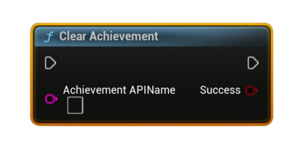

# Clear Achievement

Marks the specified achievement as <b>locked</b> again for the local user (clears its unlocked state). Persist the change with <b>Store User Stats &amp; Achievements</b>.

#### Inputs
| `Pin` | `Type` | `Description` |
| --- | --- | --- |
| `Achievement API Name` | `String` | Exact identifier defined in Steamworks (e.g., `ACH_FINISH_LEVEL1`). |

#### Outputs
| `Pin` | `Type` | `Description` |
| --- | --- | --- |
| `Success` | `Bool` | `true` if the achievement was cleared locally. |

<h3><b>Notes</b></h3>
<ul style="font-size:0.72rem; line-height:1.75">
  <li>Call <b>Request Current Stats And Achievements</b> once before using this node (initializes local cache).</li>
  <li>Call <b>Store User Stats &amp; Achievements</b> afterward to persist the cleared state to Steam.</li>
  <li>Primarily useful for testing or designs where re-earning achievements is intentional; most games treat unlocks as permanent.</li>
  <li>Clearing does <b>not</b> reset any of your own stats—reset those separately if your achievement logic depends on them.</li>
</ul>
