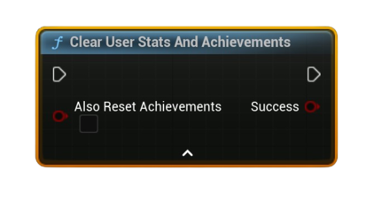

# Clear User Stats And Achievements

Clears the <b>local user’s</b> stats and optionally resets all achievements back to <b>locked</b> in the local cache. Persist the reset with <b>Store User Stats &amp; Achievements</b>.

#### Inputs
| `Pin` | `Type` | `Description` |
| --- | --- | --- |
| `Also Reset Achievements` | `Bool` | If <code>true</code>, clears achievement unlock states as well as stats. If <code>false</code>, only stats are cleared. |

#### Outputs
| `Pin` | `Type` | `Description` |
| --- | --- | --- |
| `Success` | `Bool` | `true` if the local reset request was applied to the cache. |

<h3><b>Notes</b></h3>
<ul style="font-size:0.72rem; line-height:1.75">
  <li><b>Pure</b> node (no async work). Acts on the local cache immediately.</li>
  <li>Call <b>Store User Stats &amp; Achievements</b> afterward to persist changes to Steam.</li>
  <li>Primarily for QA/debug menus—most shipped games do <b>not</b> expose a full reset to players.</li>
  <li>After storing, you can call <b>Request Current Stats And Achievements</b> to refresh the cache from Steam.</li>
</ul>

<h3><b>Typical usage</b></h3>
<ul style="font-size:0.72rem; line-height:1.75">
  <li>Developer/QA tool: Clear (with or without achievements) → <b>Store User Stats &amp; Achievements</b> → <b>Request Current Stats And Achievements</b> → re-test unlock logic.</li>
</ul>
