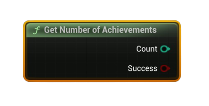

# Get Number Of Achievements

Returns the total number of achievements defined for this app (from the Steam schema).

#### Outputs
| `Pin` | `Type` | `Description` |
| --- | --- | --- |
| `Count` | `int32` | Number of achievements available for this app. |
| `Success` | `Bool` | `true` if the count was retrieved successfully. |

<h3><b>Notes</b></h3>
<ul style="font-size:0.72rem; line-height:1.75">
  <li><b>Pure</b> node (no async work).</li>
  <li>Useful to iterate achievements by index with <b>Get Achievement API Name</b> / <b>Get Achievement Display Info</b>.</li>
</ul>
