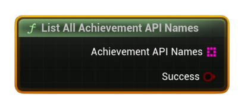

# List All Achievement API Names

Returns an array of every achievement’s <b>API name</b> defined for this app (from the Steam schema).

#### Outputs
| `Pin` | `Type` | `Description` |
| --- | --- | --- |
| `Achievement API Names` | `String[]` | All API identifiers (e.g., `ACH_FINISH_LEVEL1`). |
| `Success` | `Bool` | `true` if names were retrieved successfully. |

<h3><b>Notes</b></h3>
<ul style="font-size:0.72rem; line-height:1.75">
  <li><b>Pure</b> node (no async work).</li>
  <li>Call <b>Request Current Stats And Achievements</b> earlier in the session to ensure schema data is available locally.</li>
  <li>Use to iterate and feed into other nodes (status, display info, icon).</li>
</ul>
