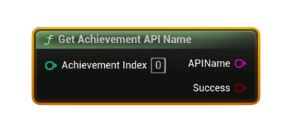

# Get Achievement API Name

Returns the achievement’s <b>API identifier</b> (string) by <b>index</b>, allowing you to enumerate all achievements.

#### Inputs
| `Pin` | `Type` | `Description` |
| --- | --- | --- |
| `Index` | `int32` | Zero-based achievement index (0..`Count-1`). Use with <b>Get Number Of Achievements</b>. |

#### Outputs
| `Pin` | `Type` | `Description` |
| --- | --- | --- |
| `API Name` | `String` | The Steamworks API name (e.g., `ACH_FINISH_LEVEL1`). |
| `Success` | `Bool` | `true` if the index was valid and a name was returned. |

<h3><b>Notes</b></h3>
<ul style="font-size:0.72rem; line-height:1.75">
  <li><b>Pure</b> node (no async work).</li>
  <li>Use this to iterate and then feed the API name into other nodes (status, display info, icon).</li>
</ul>
