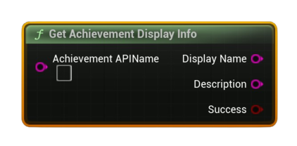

# Get Achievement Display Info

Returns the user-facing <b>Display Name</b>, <b>Description</b>, and <b>Hidden</b> flag for an achievement (by API name).

#### Inputs
| `Pin` | `Type` | `Description` |
| --- | --- | --- |
| `Achievement API Name` | `String` | Exact identifier defined in Steamworks. |

#### Outputs
| `Pin` | `Type` | `Description` |
| --- | --- | --- |
| `Display Name` | `String` | Localized achievement title (if available). |
| `Description` | `String` | Localized description (if available). |
| `Success` | `Bool` | `true` if data was found for the API name. |

<h3><b>Notes</b></h3>
<ul style="font-size:0.72rem; line-height:1.75">
  <li><b>Pure</b> node (no async work).</li>
  <li>Ensure your achievement metadata is configured in Steamworks; localization depends on your schema.</li>
  <li>Pair with <b>Get Achievement Status</b> to show lock state alongside display text.</li>
</ul>
