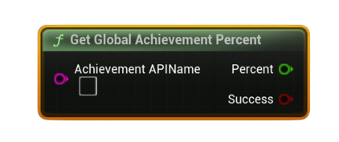

# Get Global Achievement Percent

Returns the <b>global unlock percentage</b> (0–100) for the specified achievement across all players.

#### Inputs
| `Pin` | `Type` | `Description` |
| --- | --- | --- |
| `Achievement API Name` | `String` | Exact identifier defined in Steamworks (e.g., `ACH_FINISH_LEVEL1`). |

#### Outputs
| `Pin` | `Type` | `Description` |
| --- | --- | --- |
| `Percent` | `float` | Global unlock rate for this achievement (0–100). |
| `Success` | `Bool` | `true` if a percentage was retrieved. |

<h3><b>Notes</b></h3>
<ul style="font-size:0.72rem; line-height:1.75">
  <li><b>Pure</b> node (no async work).</li>
  <li>Achievement must exist in your Steamworks schema.</li>
  <li>Use to sort/show rarity (“Ultra Rare”, etc.) in your UI.</li>
</ul>
