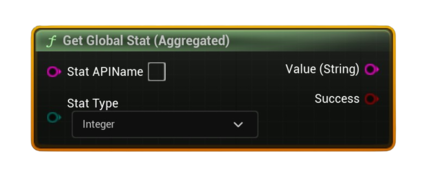

# Get Global Stat (Aggregated)

Reads a single <b>global</b> (app-wide) aggregated stat from Steam’s cache after a successful <b>Request Global Stats</b>.

#### Inputs
| `Pin` | `Type` | `Description` |
| --- | --- | --- |
| `Stat API Name` | `String` | Exact identifier defined in Steamworks (e.g., `ST_KILLS`). |
| `Stat Type` | `Enum (Integer / Float / Average)` | Interprets the aggregated value accordingly. |

#### Outputs
| `Pin` | `Type` | `Description` |
| --- | --- | --- |
| `Value (String)` | `String` | Stringified value (ints without decimals; floats sanitized). |
| `Success` | `Bool` | `true` if the stat was found in the global cache. |

<h3><b>Notes</b></h3>
<ul style="font-size:0.72rem; line-height:1.75">
  <li>Call <b>Request Global Stats</b> (with an appropriate day window) before using this node.</li>
  <li>Output is a <b>string</b> for easy display/logging—convert to number in Blueprint if needed.</li>
  <li>Aggregated values represent the entire player base, not the local user.</li>
</ul>
