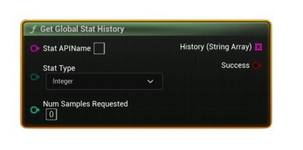

# Get Global Stat History

Returns a <b>time series</b> (string array) for a global aggregated stat after a successful <b>Request Global Stats</b>.

#### Inputs
| `Pin` | `Type` | `Description` |
| --- | --- | --- |
| `Stat API Name` | `String` | Exact identifier defined in Steamworks. |
| `Stat Type` | `Enum (Integer / Float / Average)` | Interprets history values accordingly. |
| `Num Samples Requested` | `int32` | Number of points to return (index <code>0</code> = most recent). |

#### Outputs
| `Pin` | `Type` | `Description` |
| --- | --- | --- |
| `History (String Array)` | `String[]` | Ordered values (newest first). Length ≤ requested samples depending on available history. |
| `Success` | `Bool` | `true` if history was returned. |

<h3><b>Notes</b></h3>
<ul style="font-size:0.72rem; line-height:1.75">
  <li>Call <b>Request Global Stats</b> with a <b>Days</b> window that covers your desired history length.</li>
  <li>Index <code>0</code> is the most recent value.</li>
  <li>Values are stringified—convert to numbers to graph in your UI.</li>
</ul>
