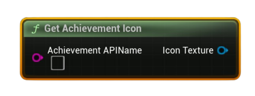

# Get Achievement Icon

Returns the achievement’s <b>icon texture</b> (locked/unlocked) so you can display it in UI.

#### Inputs
| `Pin` | `Type` | `Description` |
| --- | --- | --- |
| `Achievement API Name` | `String` | Exact identifier defined in Steamworks. |

#### Outputs
| `Pin` | `Type` | `Description` |
| --- | --- | --- |
| `Icon` | `Texture2D` | The icon texture asset generated at runtime (may be `None` if not available). |

<h3><b>Notes</b></h3>
<ul style="font-size:0.72rem; line-height:1.75">
  <li><b>Pure</b> node (no async work).</li>
  <li>Icons must be set up in Steamworks; if not configured, this can return no texture.</li>
  <li>For dynamic UIs, combine with <b>Get Achievement Status</b> to choose locked vs unlocked icon automatically.</li>
</ul>
