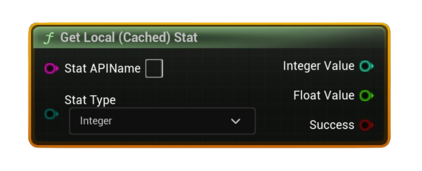

# Get Local (Cached) Stat

Reads a user stat from the <b>local Steam cache</b>. Select the <b>Stat Type</b>; the value is returned in the matching output pin.

#### Inputs
| `Pin` | `Type` | `Description` |
| --- | --- | --- |
| `Stat API Name` | `String` | Exact stat identifier defined in Steamworks (e.g., `ST_KILLS`). |
| `Stat Type` | `Enum (Integer / Float / Average)` | Which kind of stat to read. *(Average returns a float rate.)* |

#### Outputs
| `Pin` | `Type` | `Description` |
| --- | --- | --- |
| `Integer Value` | `int32` | Populated when **Stat Type = Integer**. |
| `Float Value` | `float` | Populated when **Stat Type = Float** or **Average** (rate). |
| `Success` | `Bool` | `true` if the value was read from the local cache. |

<h3><b>Notes</b></h3>
<ul style="font-size:0.72rem; line-height:1.75">
  <li>Call <b>Request Current Stats And Achievements</b> once per session to initialize the local cache.</li>
  <li>This reads from the <b>local</b> cache only (no network).</li>
  <li>For <b>Average</b> stats, Steam stores a float rate; read it via <b>Float Value</b>.</li>
</ul>
