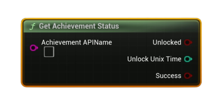

# Get Achievement Status

Returns whether an achievement is currently <b>unlocked</b> for the local user and, if so, the <b>Unix time</b> when it was unlocked.

#### Inputs
| `Pin` | `Type` | `Description` |
| --- | --- | --- |
| `Achievement API Name` | `String` | Exact identifier defined in Steamworks (e.g., `ACH_FINISH_LEVEL1`). |

#### Outputs
| `Pin` | `Type` | `Description` |
| --- | --- | --- |
| `Unlocked` | `Bool` | `true` if the achievement is unlocked for the local user. |
| `Unlock Unix Time` | `int32` | Seconds since Unix epoch (`1970-01-01 UTC`) when it was unlocked; `0` if never unlocked. |
| `Success` | `Bool` | `true` if the query was valid (API name exists, data available). |

<h3><b>Notes</b></h3>
<ul style="font-size:0.72rem; line-height:1.75">
  <li><b>Pure</b> node (no async work).</li>
  <li>Call <b>Request Current Stats And Achievements</b> earlier in the session to ensure fresh cached data.</li>
  <li>The <b>Achievement API Name</b> must match exactly what you configured in Steamworks.</li>
  <li><code>Unlock Unix Time = 0</code> indicates the achievement hasn’t been unlocked yet.</li>
</ul>
