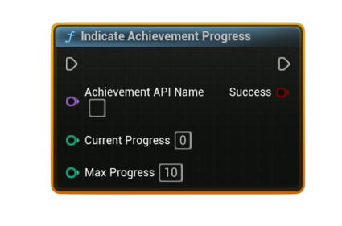

# Indicate Achievement Progress

Displays Steam’s built-in **achievement progress** toast (e.g., <i>5 / 10</i>) for an incremental achievement. This does <b>not</b> unlock or store by itself; combine with stat updates and a later store.

#### Inputs
| `Pin` | `Type` | `Description` |
| --- | --- | --- |
| `Achievement API Name` | `String` | Exact identifier defined in Steamworks (e.g., `ACH_COLLECT_10_SHARDS`). |
| `Current Progress` | `int32` | Current amount toward completion (e.g., `5`). |
| `Max Progress` | `int32` | Target amount for completion (e.g., `10`). Must be `> 0`. |

#### Outputs
| `Pin` | `Type` | `Description` |
| --- | --- | --- |
| `Success` | `Bool` | `true` if the progress toast was accepted for display. |

<h3><b>Notes</b></h3>
<ul style="font-size:0.72rem; line-height:1.75">
  <li>Call <b>Request Current Stats And Achievements</b> once before using achievement/stat nodes.</li>
  <li>This node only shows a UI toast; it does <b>not</b> unlock the achievement or persist any values.</li>
  <li>Pair it with a stat update (<b>Set/Add Local (Cached) Stat</b>) and persist via <b>Store User Stats &amp; Achievements</b>.</li>
  <li>When progress reaches the target, unlock explicitly with <b>Set Achievement (Unlock)</b>, then store.</li>
  <li>Avoid spamming frequent toasts—trigger on meaningful increments or milestones.</li>
</ul>

<h3><b>Typical usage</b></h3>
<ul style="font-size:0.72rem; line-height:1.75">
  <li>Increment a counter stat (e.g., <code>ST_COLLECTED</code>) → call <b>Indicate Achievement Progress</b> with <code>Current</code>/<code>Max</code>.</li>
  <li>If <code>Current &gt;= Max</code>: call <b>Set Achievement (Unlock)</b> → <b>Store User Stats &amp; Achievements</b>.</li>
</ul>
