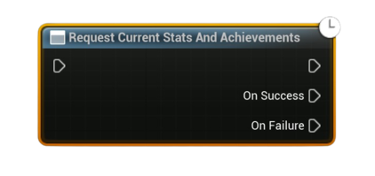

# Request Current Stats And Achievements

Asynchronously loads the **local user’s** current stats and achievement states from Steam into the local cache.

<b> :warning: Call this once before reading/writing stats or unlocking achievements.</b>

#### Outputs
| `Pin` | `Type` | `Description` |
| --- | --- | --- |
| `On Success` | `Exec` | Fired when Steam returns the user’s current stats/achievements. |
| `On Failure` | `Exec` | Fired on I/O failure or when Steam is unavailable. |
| `Error Message` *(On Failure)* | `String` | Reason for failure (useful for logs/UI). |

<h3><b>Notes</b></h3>
<ul style="font-size:0.72rem; line-height:1.75">
  <li>Call this once on startup (or when returning to the main menu) before using any achievement/stat nodes.</li>
  <li>Required prior to: <b>Set/Add Local Stat</b>, <b>Store User Stats And Achievements</b>, <b>Indicate Achievement Progress</b>, and achievement unlocks.</li>
  <li>Works only for the <b>local user</b>. Remote users’ stats aren’t exposed via this call.</li>
  <li>If it fails, check <b>Is Steam Available</b> and your Online Subsystem Steam setup.</li>
</ul>
