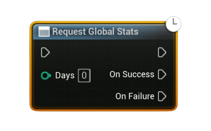

# Request Global Stats

Asynchronously requests **global app-wide stats** from Steam, including optional <b>N-day history</b>. Call this before reading global aggregates or history via pure nodes.

#### Inputs
| `Pin` | `Type` | `Description` |
| --- | --- | --- |
| `Days (History)` | `int32` | Number of days of history to fetch. Use `0` for **all-time** (no per-day history). Typical values: `1`, `7`, `30`. |

#### Outputs
| `Pin` | `Type` | `Description` |
| --- | --- | --- |
| `On Success` | `Exec` | Fired when Steam returns global stats for the requested window. |
| `On Failure` | `Exec` | Fired on I/O failure or when Steam is unavailable. |

<h3><b>Notes</b></h3>
<ul style="font-size:0.72rem; line-height:1.75">
  <li>This populates the local cache for <b>global</b> statistics (for the whole player base), not per-user stats.</li>
  <li>After success, read values using your pure helpers (e.g., <b>Get Global Stat (Aggregated)</b>, <b>Get Global Stat History</b>).</li>
  <li><code>Days</code> is clamped to <code>&ge; 0</code>; <code>0</code> requests all-time aggregates only.</li>
  <li>Use <b>Is Steam Available</b> to guard this call; ensure Steam OSS is enabled and the Steam client is running.</li>
  <li>Does not modify any data—this is a read/populate operation only.</li>
</ul>

<h3><b>Typical usage</b></h3>
<ul style="font-size:0.72rem; line-height:1.75">
  <li>On startup or stats screen open: <b>Request Global Stats</b> (e.g., <code>7</code> days) → <b>Get Global Stat (Aggregated)</b> for all-time totals → <b>Get Global Stat History</b> to chart the last 7 days.</li>
</ul>
