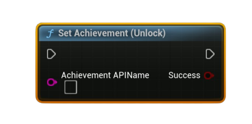

# Set Achievement (Unlock)

Marks the specified achievement as <b>unlocked</b> for the local user. Persist the change by calling <b>Store User Stats &amp; Achievements</b> afterward.

#### Inputs
| `Pin` | `Type` | `Description` |
| --- | --- | --- |
| `Achievement API Name` | `String` | Exact identifier defined in Steamworks (e.g., `ACH_FINISH_LEVEL1`). |

#### Outputs
| `Pin` | `Type` | `Description` |
| --- | --- | --- |
| `Success` | `Bool` | `true` if the achievement is marked unlocked locally. |

<h3><b>Notes</b></h3>
<ul style="font-size:0.72rem; line-height:1.75">
  <li>Call <b>Request Current Stats And Achievements</b> once before using this node (initializes local cache).</li>
  <li>Call <b>Store User Stats &amp; Achievements</b> after unlocking to persist the change to Steam.</li>
  <li><b>Achievement API Name</b> must match exactly what you configured in Steamworks.</li>
  <li>Safe to call multiple times (keeps it unlocked).</li>
</ul>
