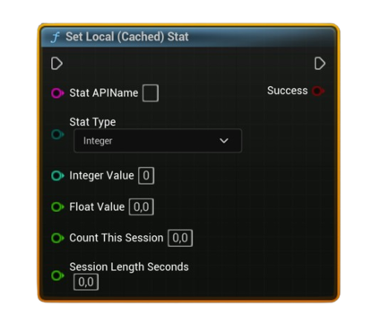

# Set Local (Cached) Stat

Writes a user stat into the **local Steam cache**. Choose the Stat Type and fill the matching value pins (Integer / Float, or AvgRate: Count & Seconds). Call <b>Store User Stats &amp; Achievements</b> afterward to persist.

#### Inputs
| `Pin` | `Type` | `Description` |
| --- | --- | --- |
| `Stat API Name` | `String` | Exact stat identifier defined in Steamworks (e.g., `ST_KILLS`). |
| `Stat Type` | `Enum (Integer / Float / Average)` | Select which kind of stat you’re writing. |
| `Integer Value` | `int32` | Used when **Stat Type = Integer**. |
| `Float Value` | `float` | Used when **Stat Type = Float**. |
| `Count This Session` | `float` | Used when **Stat Type = Average**: number of occurrences in this measurement window. |
| `Session Length Seconds` | `float` | Used when **Stat Type = Average**: duration (seconds) for the above count; must be `> 0`. |

#### Outputs
| `Pin` | `Type` | `Description` |
| --- | --- | --- |
| `Success` | `Bool` | `true` if the value was written to the **local** Steam cache. |

<h3><b>Notes</b></h3>
<ul style="font-size:0.72rem; line-height:1.75">
  <li>Call <b>Request Current Stats And Achievements</b> once before using this node (initializes the local cache).</li>
  <li>This does <b>not</b> upload by itself—finish with <b>Store User Stats &amp; Achievements</b> to persist to Steam.</li>
  <li><b>Integer</b> → <code>SetStat(int)</code>, <b>Float</b> → <code>SetStat(float)</code>, <b>Average</b> → <code>UpdateAvgRateStat(Count, Seconds)</code> (Seconds must be &gt; 0).</li>
  <li>For <b>Average</b> stats, the stored value is a float rate; when reading, use your “Get Stored Stat” node with <b>Stat Type = Average</b> to retrieve the float.</li>
  <li>Failures typically indicate Steam isn’t available (check <b>Is Steam Available</b>) or a bad <b>Stat API Name</b>.</li>
</ul>

<h3><b>Typical usage</b></h3>
<ul style="font-size:0.72rem; line-height:1.75">
  <li>On kill: <b>Set Local (Cached) Stat</b> (<code>ST_KILLS</code>, Integer += 1) → periodically <b>Store User Stats &amp; Achievements</b>.</li>
  <li>For DPS/Rate: accumulate <b>Count This Session</b> over <b>Session Length Seconds</b> → <b>Set Local (Cached) Stat</b> with <b>Average</b> → <b>Store</b>.</li>
</ul>
