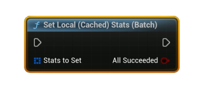

# Set Local (Cached) Stats (Batch)

Writes <b>multiple</b> user stats into the <b>local Steam cache</b> in one call. Each array item selects the stat’s API name and type (Integer / Float / Average). Call <b>Store User Stats &amp; Achievements</b> afterward to persist.

#### Inputs
| `Pin` | `Type` | `Description` |
| --- | --- | --- |
| `Stats To Set` | `TArray<FSAL_StatWrite>` | Array of writes. For each element: • `APIStatName` (String) • `StatType` (Enum: Integer / Float / Average) • `IntegerValue` (when Integer) • `FloatValue` (when Float) • `CountThisSession` & `SessionLengthSeconds` (when Average; seconds must be > 0) |

#### Outputs
| `Pin` | `Type` | `Description` |
| --- | --- | --- |
| `All Succeeded` | `Bool` | `true` if every item was written to the <b>local</b> cache. (`true` for an empty array / no-op) |

<h3><b>Notes</b></h3>
<ul style="font-size:0.72rem; line-height:1.75">
  <li>Call <b>Request Current Stats And Achievements</b> once before batch operations (initializes the local cache).</li>
  <li>This is a local write only—finish with <b>Store User Stats &amp; Achievements</b> to push changes to Steam.</li>
  <li>Each element uses the fields that match its <b>StatType</b>: Integer → <code>SetStat(int)</code>, Float → <code>SetStat(float)</code>, Average → <code>UpdateAvgRateStat(Count, Seconds)</code> (Seconds must be &gt; 0).</li>
  <li>If any individual write fails, <b>All Succeeded</b> becomes <code>false</code> (others may still have applied).</li>
  <li>Passing an <b>empty array</b> is allowed and treated as success (no changes).</li>
</ul>

<h3><b>Typical usage</b></h3>
<ul style="font-size:0.72rem; line-height:1.75">
  <li>End of level/checkpoint: gather several updates into <b>Stats To Set</b> → call <b>Set Local (Cached) Stats (Batch)</b> → <b>Store User Stats &amp; Achievements</b>.</li>
  <li>Periodic autosave: accumulate session counters and an average rate stat → batch set → store.</li>
</ul>
