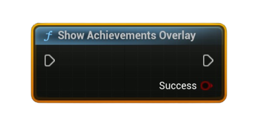

# Show Achievement Overlay

Opens the Steam client’s **Achievements** page for the current app in the Steam Overlay (local user).

#### Outputs
| `Pin` | `Type` | `Description` |
| --- | --- | --- |
| `Success` | `Bool` | `true` if the overlay request was issued successfully. |

<h3><b>Notes</b></h3>
<ul style="font-size:0.72rem; line-height:1.75">
  <li><b>Pure</b> node (no async work).</li>
  <li>Requires the Steam client to be running and the <b>Steam Overlay enabled</b> in user settings.</li>
  <li>Some environments (e.g., dedicated servers, certain launch modes) do not support the overlay.</li>
  <li>This does <b>not</b> unlock or refresh achievements—use <b>Set Achievement (Unlock)</b> and <b>Store User Stats &amp; Achievements</b> for changes.</li>
</ul>
