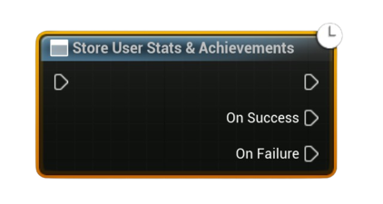

# Store User Stats & Achievements

Asynchronously **persists** the local user’s updated stats and achievement changes to Steam. 

<b> :warning: Call this after modifying cached stats or unlocking/clearing achievements.</b>

#### Outputs
| `Pin` | `Type` | `Description` |
| --- | --- | --- |
| `On Success` | `Exec` | Fired when Steam confirms the write/store operation. |
| `On Failure` | `Exec` | Fired on I/O failure or when Steam is unavailable. |

<h3><b>Notes</b></h3>
<ul style="font-size:0.72rem; line-height:1.75">
  <li>Call <b>Request Current Stats And Achievements</b> once before using this node; it initializes the local cache.</li>
  <li>This pushes pending <b>stat</b> updates and <b>achievement</b> state changes for the <b>local user</b> to Steam.</li>
  <li>Avoid spamming: store at checkpoints, end-of-level, or every X minutes rather than every tick.</li>
  <li>If the write fails, keep your local values and retry later (e.g., when the user is back online).</li>
</ul>

<h3><b>Typical usage</b></h3>
<ul style="font-size:0.72rem; line-height:1.75">
  <li>Update stats with <b>Set/Add Local (Cached) Stat</b> → unlock with <b>Set Achievement (Unlock)</b> if thresholds met → <b>Store User Stats &amp; Achievements</b>.</li>
  <li>Use after <b>Indicate Achievement Progress</b> when you also changed an underlying stat you want persisted.</li>
</ul>
