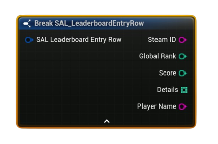

# FSAL_LeaderboardEntryRow

Blueprint struct representing a single downloaded leaderboard row from Steam.

#### Fields
| `Field` | `Type` | `Description` |
| --- | --- | --- |
| `SteamID` | `String` | Player’s SteamID64 (e.g., `7656119...`). |
| `GlobalRank_` | `int32` | 1-based global rank (`1` = top). |
| `Score` | `int32` | The stored score value for this leaderboard. |
| `Details[]` | `int32[]` | Optional integers uploaded with the score (e.g., laps, deaths, stage). Up to **64** values supported by Steam. |
| `PlayerName` | `String` | Player’s current Steam display name (may be empty if not cached yet). |

<h3><b>Notes</b></h3>
<ul style="font-size:0.72rem; line-height:1.75">
  <li><code>GlobalRank</code> is <b>1-based</b> as reported by Steam.</li>
  <li><code>Score</code> formatting in UI is determined by the leaderboard’s <b>Display Type</b> (Numeric / Time).</li>
  <li><code>Details[]</code> are only populated if you requested them (set <b>Details Max</b> &gt; 0 on download).</li>
  <li><code>PlayerName</code> can be empty initially; it is filled when Steam name data is available/cached.</li>
</ul>

<h3><b>Typical usage</b></h3>
<ul style="font-size:0.72rem; line-height:1.75">
  <li>Show rank/score/name in a leaderboard UI.</li>
  <li>Read <code>Details[]</code> to display extra metadata saved during upload (e.g., per-lap times encoded as ints).</li>
</ul>
