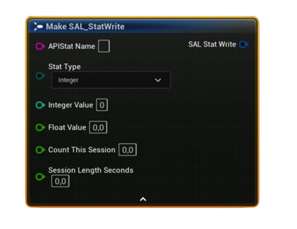

# FSAL_StatWrite

Blueprint struct describing a single <b>stat write</b> operation for Steam. Used by <i>Set Local (Cached) Stat</i> and <i>Set Local (Cached) Stats (Batch)</i>.

#### Fields
| `Field` | `Type` | `Description` |
| --- | --- | --- |
| `APIStatName` | `String` | Stat API name exactly as defined in Steamworks (e.g., `TOTAL_JUMPS`). |
| `StatType` | `Enum (Integer / Float / Average)` | Write mode. **Average** uses `CountThisSession` & `SessionLengthSeconds`. |
| `IntegerValue` | `int32` | Used when **StatType = Integer**. The new integer value to set. |
| `FloatValue` | `float` | Used when **StatType = Float**. The new float value to set. |
| `CountThisSession` | `float` | Used when **StatType = Average**. Amount counted in this measurement window (e.g., events). |
| `SessionLengthSeconds` | `float` | Used when **StatType = Average**. Duration for the measurement window in seconds (**must be > 0**). |

<h3><b>Notes</b></h3>
<ul style="font-size:0.72rem; line-height:1.75">
  <li>This struct feeds <b>Set Local (Cached) Stat</b> (single) and <b>Set Local (Cached) Stats (Batch)</b> (multiple).</li>
  <li>For <b>Average</b> stats, Steam computes a rate via <code>UpdateAvgRateStat(CountThisSession, SessionLengthSeconds)</code>; the stored value is a <b>float</b>.</li>
  <li>Writes affect the <b>local cache</b> only—persist to Steam with <b>Store User Stats &amp; Achievements</b>.</li>
  <li><b>APIStatName</b> must match your Steamworks schema exactly.</li>
</ul>

<h3><b>Typical usage</b></h3>
<ul style="font-size:0.72rem; line-height:1.75">
  <li>End-of-level batch: build an array of <code>FSAL_StatWrite</code> (mix Integer/Float/Average) → call <b>Set Local (Cached) Stats (Batch)</b> → <b>Store User Stats &amp; Achievements</b>.</li>
  <li>Average rate example: record <code>CountThisSession = 120</code> over <code>SessionLengthSeconds = 60</code> → results in a rate of <code>2.0</code> per second.</li>
</ul>
