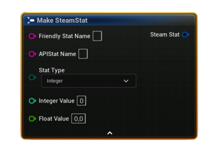

# FSAL_StoredStat (SteamStat)

Blueprint struct representing a single <b>stat value</b> read from the local Steam cache. Returned by batch reads like <i>Get Local (Cached) Stats (Batch)</i>, and used for UI/display.

#### Fields
| `Field` | `Type` | `Description` |
| --- | --- | --- |
| `FriendlyStatName` | `String` | Optional display label for UI. Falls back to `APIStatName` if empty. |
| `APIStatName` | `String` | Stat API name exactly as defined in Steamworks (e.g., `ST_KILLS`). |
| `StatType` | `Enum (Integer / Float)` | Read type used for this value. *(Average stats are returned as Float.)* |
| `IntegerValue` | `int32` | Populated when **StatType = Integer**. |
| `FloatValue` | `float` | Populated when **StatType = Float** (also used for Average/rate stats). |

<h3><b>Notes</b></h3>
<ul style="font-size:0.72rem; line-height:1.75">
  <li>Populate this via <b>Get Local (Cached) Stats (Batch)</b> after calling <b>Request Current Stats And Achievements</b> once per session.</li>
  <li><b>Average</b> (rate) stats are represented in <code>FloatValue</code>.</li>
  <li>Use <code>FriendlyStatName</code> for UI labels; if empty, display <code>APIStatName</code>.</li>
</ul>

<h3><b>Typical usage</b></h3>
<ul style="font-size:0.72rem; line-height:1.75">
  <li>Build a list of <b>FSAL_StatQuery</b> → call <b>Get Local (Cached) Stats (Batch)</b> → iterate <b>FSAL_StoredStat</b> results to fill a stats screen.</li>
  <li>Show Integer stats directly; format Float/Average stats with units (e.g., <code>MM:SS</code>, <code>per minute</code>) as needed.</li>
</ul>
