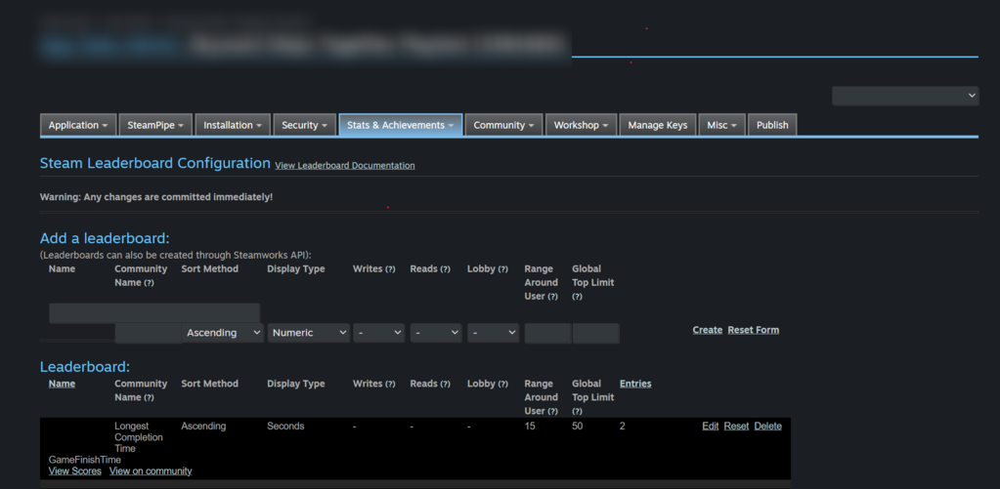

# Creating a Steam Leaderboard

Before you can upload or download scores, you need a **Steam Leaderboard** to exist for your game.  
There are **two ways** to create one:

---

## Option 1 – Using the Plugin (Blueprint Node)

SteamSAL exposes a Blueprint node:  

**Create Steam Leaderboard**  
- This node creates a new leaderboard dynamically if it doesn’t already exist.  
- You define:
  - **Leaderboard Name** (must be unique per game)  
  - **Sort Method** (Ascending or Descending)  
  - **Display Type** (Numeric, Time, etc.)  

> ⚠️ Once created, a leaderboard’s properties (sort method, display type) **cannot be changed**. If you need different rules, you must create a new leaderboard with a different name.

Use this method if you want to manage leaderboards **from inside your game** without touching the Steamworks backend.

---

## Option 2 – Using Steamworks Partner Site

You can also create and manage leaderboards directly from your game’s **Steamworks Admin Panel**:  
👉 [Steamworks Partner: Leaderboards Documentation](https://partner.steamgames.com/doc/features/leaderboards)

Steps:  
1. Log in to your Steamworks Partner account.  
2. Select your game from the dashboard.  
3. Navigate to **Leaderboards** under the **Stats & Achievements** section.  
4. Create a new leaderboard, specifying:
   - Name  
   - Sort method  
   - Display type  

This method is recommended if you prefer **centralized control** and want to configure leaderboards before shipping your game.

---

## Which Should I Use?

- Use **Blueprint node** if you want flexibility and automated setup (good for prototyping or dynamic leaderboards).  
- Use **Steamworks Partner Site** if you want **strict control** and manage everything before release.  

Both approaches are valid — once a leaderboard exists, you can access it in-game through the same workflow.  
