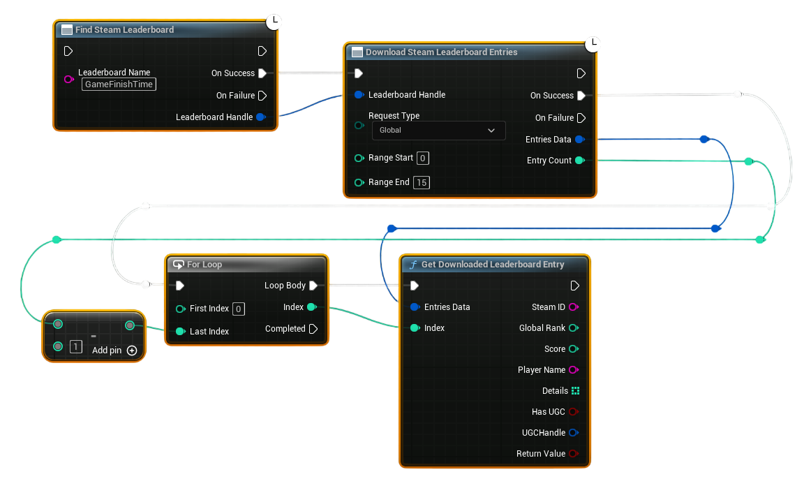

# Download Steam Leaderboard Entries

This example shows how to download leaderboard entries using the new <b>Download Steam Leaderboard Entries</b> node and then read each entry using <b>Get Downloaded Leaderboard Entry</b>.

---

## Example Workflow (Updated for v1.2.0)

### 1. **Find the Leaderboard**
- Use **Find Steam Leaderboard** with your leaderboard name.
- On **Success**, you receive a valid **Leaderboard Handle**.
- Pass this handle into the next step.

---

### 2. **Download Leaderboard Entries**
- Use **Download Steam Leaderboard Entries**.
- Connect the **Leaderboard Handle** from step 1.
- Choose your **Request Type**:
  - **Global** – download a rank range (top N).
  - **Global Around User** – download entries around the local player's position.
  - **Friends** – download only Steam friends.
- Fill **Range Start / Range End** depending on request type.
- On **Success**, the node returns:
  - **Entries Data** (a compact container of all rows)
  - **Entry Count** (how many rows were downloaded)

---

### 3. **Process Each Entry**
Use a **For Loop**:

- **First Index** = `0`
- **Last Index** = `Entry Count - 1`

Inside the loop body, call:

### **Get Downloaded Leaderboard Entry**
- Connect **Entries Data** from the download node into its input.
- Pass the current loop **Index**.
- The node outputs a full row:
  - SteamID  
  - Player Name  
  - Global Rank  
  - Score  
  - Details[]  
  - Has UGC  
  - UGC Handle  

Use these values to populate your UI or scoreboard widgets.

---

## Optional: Get Only One Entry (No Loop Needed)
If you know the exact index you want:
- Simply call **Get Downloaded Leaderboard Entry** directly.
- Pass:
  - `Entries Data`
  - Your chosen `Index`

Useful for:
- Displaying only the top score  
- Showing the player’s own rank  
- Debugging specific entries  

---

## Notes
- This replaces the old array-returning node.  
- Data stays cached until you run another download request.  
- For UGC-enabled leaderboards, check **Has UGC** and use **Download Steam UGC File** to retrieve the attached data.
