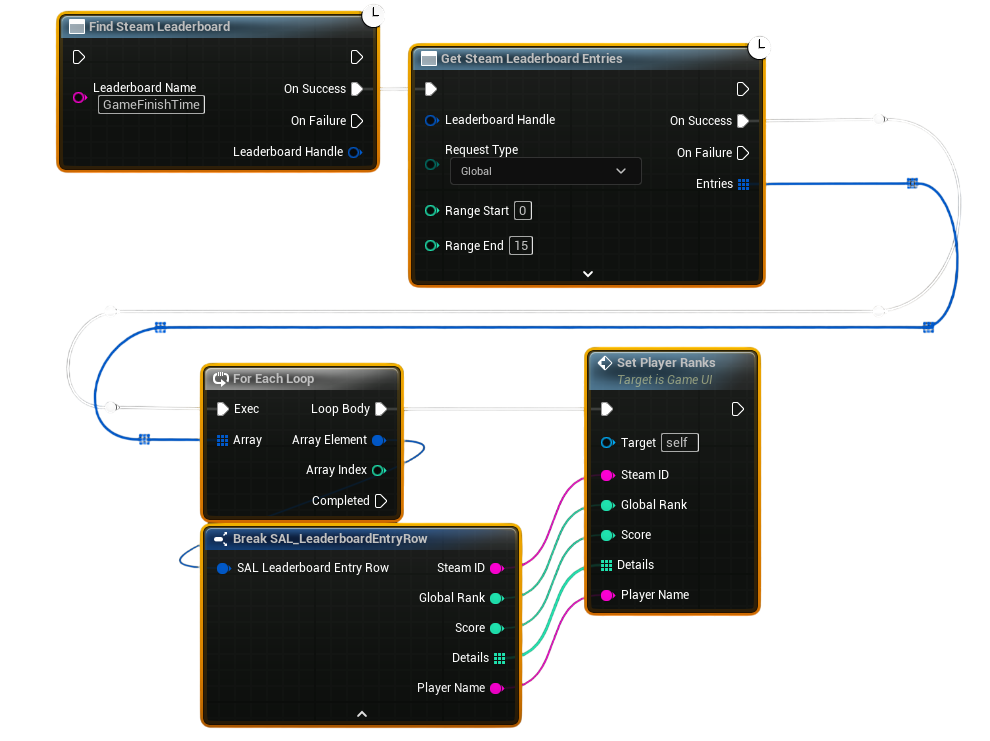

# Downloading Users Leaderboard Entries

Once scores have been uploaded, you’ll want to display them in your game.  
This workflow shows how to download leaderboard entries and present them to the player.

---

## Example Workflow

---

1. **Find the Leaderboard**  
   - Use **Find Steam Leaderboard** with the exact leaderboard name.  
   - On success, this returns a **Leaderboard Handle**.  

2. **Download Entries**  
   - Pass the handle into **Get Steam Leaderboard Entries**.  
   - Choose a **Request Type**:  
     - **Global** (all players, top N entries)  
     - **Around User** (entries around the local player’s rank)  
     - **Friends** (only the player’s Steam friends)  
   - Define the **Range Start / Range End** for how many entries to fetch.  

3. **Handle the Results**  
   - On success, you’ll get an array of **Leaderboard Entry Rows** containing:  
     - Player’s Steam ID  
     - Player name  
     - Avatar image  
     - Rank  
     - Score  

4. **Display in UI**  
   - Loop through the array and feed each entry into your widget or scoreboard UI.  
   - For example, show **Player Name – Score – Rank** with avatar images.  

---

## Notes
- Make sure the leaderboard exists before trying to download.  
- **Request Type** is important for performance: use **Around User** or **Friends** for personal views, and **Global** for leaderboards.  
- The returned data is cached in memory; you can refresh it by calling download again later.  
