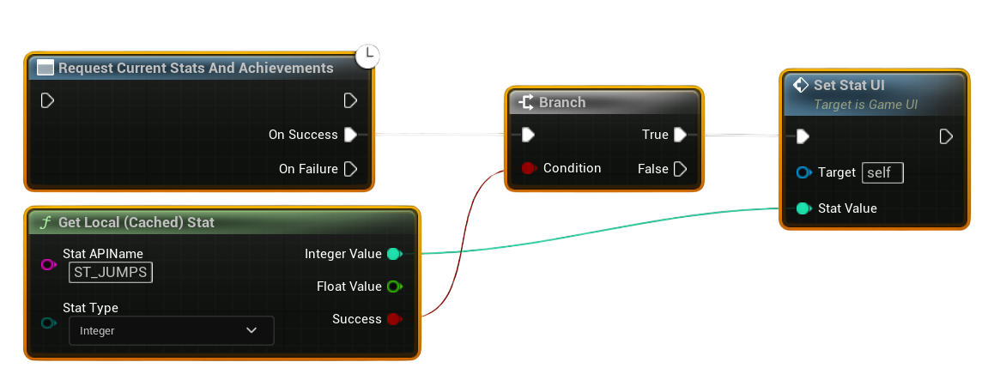

# Reading Player Stats

Steam **Stats** are numeric values that track player progress across sessions (e.g., total jumps, enemies defeated, matches won).  
Before you can read or update stats in-game, you must first **create them in your Steamworks Admin Panel**:  
👉 [Steamworks Docs – Stats & Achievements](https://partner.steamgames.com/doc/features/achievements)  

---

## Example Workflow

---

1. **Request Current Stats**  
   - At the start of a session, call **Request Current Stats and Achievements**.  
   - This ensures all local stat values are synced with the Steam backend.  

2. **Get Local Stat**  
   - Use **Get Local Stat** with the **Stat Name** you defined in Steamworks Admin Panel.  
   - This returns the player’s current value for that stat.  

3. **Use the Stat in Game Logic**  
   - The returned value can be displayed on-screen, used for gameplay checks, or updated later.  

---

## Notes
- Stats must be **predefined in the Steamworks Partner Site**. Attempting to read a stat that doesn’t exist will fail.  
- Always call **Request Current Stats** before reading values, otherwise the local cache may be out of date.  
- Stats are typically integers or floats, but you can design them around your gameplay needs (e.g., “TotalDeaths”, “TotalWins”).  
- Use **Store Stats** after updating values to make sure changes are saved permanently.  
