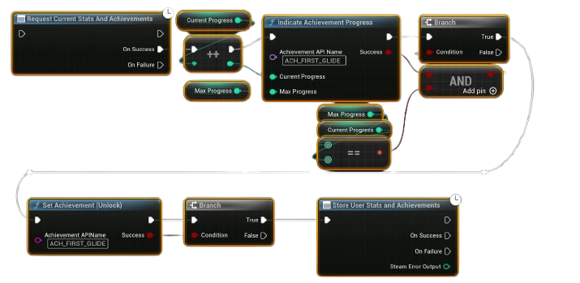

# Tracking Achievement Progress

Some achievements require partial progress (e.g., “Collect 100 coins” or “Win 20 matches”).  
Instead of waiting until the achievement is fully unlocked, you can show progress to the player.

---

## Example Workflow

---
1. **Request Current Stats**  
   - At the start of the session, call **Request Current Stats** to sync achievements and stats from Steam.  
   - This ensures progress is up to date.  

2. **Track Game Progress**  
   - Inside your game logic (e.g., every time the player wins a match, collects coins, or defeats enemies), increment your local progress counter.  

3. **Indicate Achievement Progress**  
   - Call **Indicate Achievement Progress** with:  
     - **Current Value** (e.g., 10 wins so far)  
     - **Max Value** (e.g., 20 wins needed)  
   - Steam will show a pop-up with a progress bar to the player.  

4. **Unlock Achievement (when completed)**  
   - Once the player reaches the max requirement (e.g., 20 wins), call **Unlock Achievement**.  
   - Then call **Store Stats** to save the achievement permanently to the backend.  

## Notes
- **Indicate Achievement Progress** does not unlock the achievement; it only displays progress.  
- Always call **Store Stats** after unlocking to ensure the achievement is recorded.  
- You can use this flow for achievements like:
  - “Kill 100 enemies”  
  - “Play 50 matches”  
  - “Collect 1000 coins”  