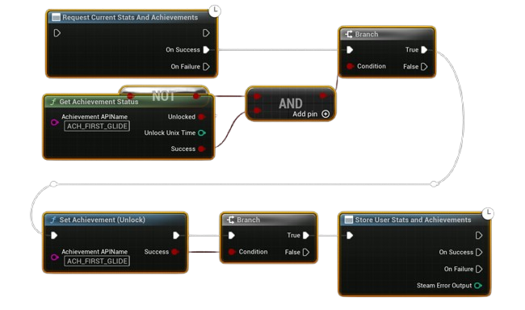

# Unlocking an Achievement

Achievements should only be unlocked after certain conditions in your game are met.  
This workflow ensures you check the current state, unlock it if needed, and then store the results.

---

## Example Workflow

---

1. **Request Current Stats and Achievements**  
   - Always start by syncing the latest stats/achievements from Steam.  

2. **Check Achievement Status**  
   - Use **Get Achievement Status** with the API name of your achievement.  
   - If it is **not unlocked**, continue.  

3. **Set Achievement (Unlock)**  
   - Trigger this when the gameplay condition is met (e.g., first glide, reaching a milestone).  

4. **Store User Stats and Achievements**  
   - Finally, call **Store Stats** so the unlock is saved permanently on the Steam backend.  
   - Steam will also display the unlock notification to the player.  

---

## Notes
- **Always check status first** to avoid trying to unlock an already unlocked achievement.  
- **Store Stats** is required, otherwise the achievement won’t persist.  
- Use meaningful API names (set in your Steamworks dashboard) like `ACH_FIRST_GLIDE`.  
