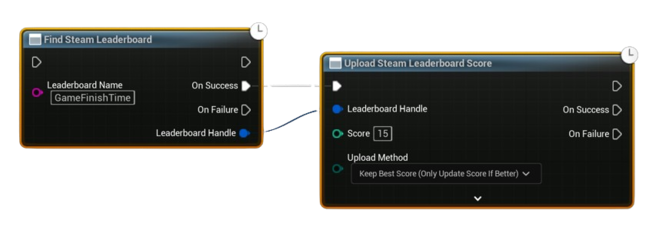

# Upload a Score to Leaderboard

Once you have created or found a leaderboard, you can upload player scores to it.  
Here’s a typical workflow in Blueprints:

---

## Example Workflow

1. **Find the Leaderboard**  
   - Use the **Find Steam Leaderboard** node.  
   - Input the **Leaderboard Name** you created earlier.  
   - The node returns a **Leaderboard Handle** on success.  

2. **Upload the Score**  
   - Pass the **Leaderboard Handle** into the **Upload Score to Leaderboard** node.  
   - Provide the player’s score (time, points, etc.) and choose the upload method:
     - **Keep Best** (Steam keeps the best score)  
     - **Force Update** (always overwrite with the new score)  

3. **Handle the Callback**  
   - On success, you’ll receive confirmation that the score was uploaded.  
   - On failure, log the error or retry.  

---

## Notes
- Make sure the leaderboard exists (either created in-game or via Steamworks Partner Site).  
- Uploading will automatically update the player’s position in the leaderboard.  
- Use **Keep Best** for time-attack or high-score leaderboards, and **Force Update** if you want the most recent score to always be shown.  
