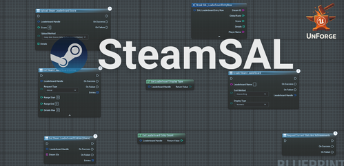

# SteamSAL – Steam Achievements & Leaderboards Plugin

{: style="display: block; margin: 0 auto;" width="800"}

> **Current Version:** `v1.2.0` – adds UGC-enabled leaderboards, new helpers, and an improved single-struct download workflow.

**SteamSAL** is a free Unreal Engine plugin that provides easy-to-use **Blueprint nodes** for integrating **Steam Achievements, Stats, and Leaderboards** into your game.  
It is designed for developers who want to bring Steamworks features into their projects without diving deep into C++ or the raw Steam API.

---

## ✨ Features
- 🔹 **Steam Achievements**  
  - Unlock achievements, check unlock state, and query global percentages.  
- 🔹 **Steam Stats**  
  - Read and write player stats, retrieve global and historical values.  
- 🔹 **Leaderboards**  
  - Create or find leaderboards, upload scores (with optional UGC attachments), download entries, and show player data (name, avatar, rank, score).  
- 🔹 **Blueprint-first Workflow**  
  - All functionality exposed as async and pure Blueprint nodes.  

---

## 📥 Source Code
The full source code is available on GitHub:  
[https://github.com/HakanCopur/steam-achievements-leaderboards](https://github.com/HakanCopur/steam-achievements-leaderboards)

---

## 🚀 Get Started
- [Installation](installation.md) – How to install the plugin in your Unreal project.  
- [Usage](examples/createleaderboard.md) – Blueprint examples and workflows.  
- [Reference](leaderboard/create.md) – Detailed documentation for each node and struct.  

---

## 📬 Support
For any questions, bug reports, or feature requests, please reach out:  
✉️ **dev@hakancopur.com**

---

## 🧑‍💻 About the Developer
Created and maintained by **Hakan Çopur**, gameplay programmer.  
You can view my portfolio and other projects at:  
👉 [www.hakancopur.com](https://www.hakancopur.com)
