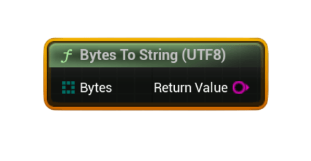

# Bytes To String (UTF8)

Converts a <code>uint8[]</code> byte array (UTF‑8 encoded) back into a <b>String</b>. Primarily used when consuming UGC payloads downloaded with <b>Download Steam UGC File</b>.

#### Inputs
| `Pin` | `Type` | `Description` |
| --- | --- | --- |
| `Bytes` | `uint8[]` | Byte array containing UTF‑8 text. |

#### Outputs
| `Pin` | `Type` | `Description` |
| --- | --- | --- |
| `Return Value` | `String` | The decoded UTF‑8 string. |

### Usage
- Use when your UGC contains JSON, text, metadata, or structured text.
- Common workflow:  
  **Download Steam UGC File → Bytes To String (UTF8)**

### Notes
- If the byte array is empty, the result is an empty string.
- Required for workflows involving UGC upload/download.
