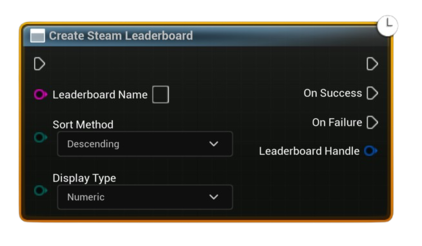

# Create Steam Leaderboard

Asynchronously creates a Steam leaderboard with the given name, sort, and display settings.

#### Inputs
| `Pin` | `Type` | `Description` |
| --- | ---- | ----------- |
| `Leaderboard Name` | `String`  | Name of the leaderboard (must match exactly). |
| `Sort Method` | `Enum (Ascending/Descending)` | Determines how scores are ordered. |
| `Display Type` | `Enum (Numeric/Time/etc.)`  | UI formatting on Steam. |

#### Outputs
| `Pin` | `Type` | `Description` |
| --- | ---- | ----------- |
| `On Success` | `Exec` | Fired when the Steam callback succeeds. |
| `On Failure` | `Exec` | Fired on IO failure or invalid params. |
| `Leaderboard Handle` | `FSAL_LeaderboardHandle` | Valid Leaderboard handle for subsequent calls. |

