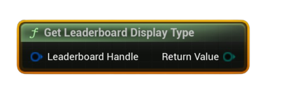

# Get Leaderboard Display Type

Returns the **Display Type** of a Steam leaderboard (how scores should be shown: numeric or time-based) from a valid handle.

#### Inputs
| `Pin` | `Type` | `Description` |
| --- | --- | --- |
| `Leaderboard Handle` | `FSAL_LeaderboardHandle` | Handle obtained from **Find** or **Create** (must be valid). |

#### Outputs
| `Pin` | `Type` | `Description` |
| --- | --- | --- |
| `Display Type` | `Enum` | The leaderboard’s display mode, e.g. **Numeric**, **TimeSeconds**, **TimeMilliSeconds**. |

<h3><b>Notes</b></h3>
<ul style="font-size:0.72rem; line-height:1.75">
  <li>This is a <b>pure</b> node (no latent/async work).</li>
  <li>The value reflects how the leaderboard was configured when it was <b>created</b> on Steam.</li>
  <li>Use it to format scores correctly in UI (e.g., convert to <code>MM:SS.mmm</code> for time boards).</li>
</ul>
