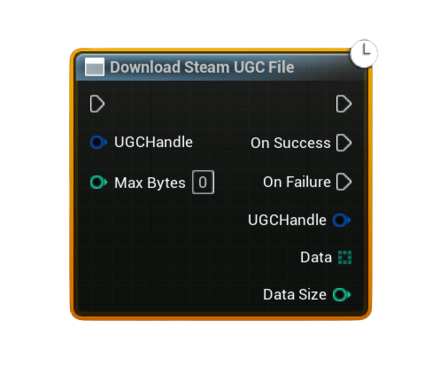

# Download Steam UGC File

Downloads the raw <b>binary data</b> of a UGC file from Steam Remote Storage using a <b>UGC handle</b>. Use this together with leaderboard entries that have UGC attached to retrieve complex payloads like replays, ghost runs, screenshots, JSON blobs, or any other custom data you previously uploaded.
<ul style="font-size:0.72rem; line-height:1.75">
  <li><b>Important – Steam Cloud / Remote Storage:</b> UGC upload and download require Steam Cloud to be enabled for your app in Steamworks.</li>
  <li>In your app’s Steamworks settings, enable <b>Steam Cloud</b> and set:
    <ul>
      <li>a reasonable <b>Byte quota per user</b> (enough for your replay / ghost / save data), and</li>
      <li>a reasonable <b>Number of files allowed per user</b>.</li>
    </ul>
  </li>
  <li>If these values are <code>0</code> or too low, UGC operations may fail or be rejected, causing the UGC nodes to fire <b>On Failure</b>.</li>
</ul>

#### Inputs
| `Pin` | `Type` | `Description` |
| --- | --- | --- |
| `UGC Handle` | `FSAL_UGCHandle` | A valid UGC handle, typically obtained from <b>Get Downloaded Leaderboard Entry</b> (Has UGC + UGC Handle) or from <b>Upload Steam Leaderboard Score With UGC</b>. |
| `Max Bytes` | `int32` | Optional hard upper limit for bytes to download. `&lt;= 0` = no explicit limit (download full file size). If positive, the node will download at most this many bytes from the file. |

#### Outputs
| `Pin` | `Type` | `Description` |
| --- | --- | --- |
| `On Success` | `Exec` | Fired when the UGC file is successfully downloaded and read from Steam Remote Storage. |
| `On Failure` | `Exec` | Fired if the handle is invalid, Steam Remote Storage is unavailable, or the download/read operation fails. |
| `UGC Handle` *(On Success)* | `FSAL_UGCHandle` | Echo of the input handle for convenience and chaining. |
| `Data` *(On Success)* | `uint8[]` | Raw bytes of the downloaded UGC file. Use helper nodes like <b>Bytes To String (UTF8)</b> or <b>Save Bytes To File</b> depending on how you want to consume it. |
| `Data Size` *(On Success)* | `int32` | Number of bytes actually downloaded (may be less than file’s total size if <code>Max Bytes</code> was set). |
| `Error Message` *(On Failure)* | `String` | Human-readable description of why the operation failed. |

<h3><b>Usage</b></h3>
<ul style="font-size:0.72rem; line-height:1.75">
  <li>Download leaderboard entries using <b>Download Steam Leaderboard Entries</b> or <b>Download Steam Leaderboard Entries (Users)</b>.</li>
  <li>For each row, call <b>Get Downloaded Leaderboard Entry</b> and check <b>Has UGC</b>.</li>
  <li>If <b>Has UGC</b> is <b>true</b>, pass the returned <b>UGC Handle</b> into <b>Download Steam UGC File</b>.</li>
  <li>On <b>Success</b>, you receive the raw <code>Data</code> as a <code>uint8[]</code> plus <code>Data Size</code>:
    <ul>
      <li>For JSON / text payloads, convert back using <b>Bytes To String (UTF8)</b>.</li>
      <li>For binary formats (replays, ghosts, screenshots, etc.), either parse the bytes in Blueprint/C++ or save them to disk with <b>Save Bytes To File</b>.</li>
    </ul>
  </li>
</ul>

<h3><b>Notes</b></h3>
<ul style="font-size:0.72rem; line-height:1.75">
  <li>If the <b>UGC Handle</b> is invalid, the node fails immediately with an error message.</li>
  <li>The node requires <b>Steam Remote Storage</b> to be available; if it is not, <b>On Failure</b> is fired.</li>
  <li>The full file size is obtained from Steam first. If <code>Max Bytes</code> is set and smaller than that size, only the first <code>Max Bytes</code> are read.</li>
  <li>If Steam returns 0 or a negative byte count, the node fails and reports the issue via <b>Error Message</b>.</li>
  <li>This is the counterpart of <b>Upload Steam Leaderboard Score With UGC</b>: use that node to upload complex data together with a score, and this node to download and reconstruct that data later.</li>
</ul>
