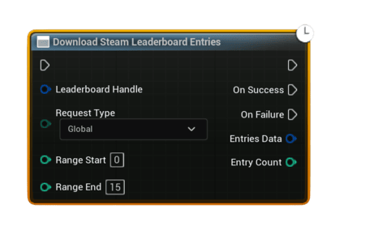

# Download Steam Leaderboard Entries

Asynchronously downloads leaderboard rows for the chosen <b>scope</b> (Global, Global Around User, or Friends). Returns a compact <code>Entries Data</code> handle + row count. Use <b>Get Downloaded Leaderboard Entry</b> to read individual rows.

#### Inputs
| `Pin` | `Type` | `Description` |
| --- | --- | --- |
| `Leaderboard Handle` | `FSAL_LeaderboardHandle` | Handle from **Find** or **Create** (must be valid). |
| `Request Type` | `Enum (Global / Global Around User / Friends)` | Selects the scope of results. |
| `Range Start` | `int32` | For **Global**: 1-based start rank. For **Global Around User**: negative offset (e.g. `-5`). Ignored for **Friends**. |
| `Range End` | `int32` | For **Global**: 1-based end rank. For **Global Around User**: positive offset (e.g. `+5`). Ignored for **Friends**. |

#### Outputs
| `Pin` | `Type` | `Description` |
| --- | --- | --- |
| `On Success` | `Exec` | Fired when rows are downloaded successfully. |
| `On Failure` | `Exec` | Fired on I/O failure, invalid handle, or bad range. |
| `Entries Data` *(On Success)* | `FSAL_LeaderboardEntriesData` | Container holding all downloaded rows and request metadata. Pass this into **Get Downloaded Leaderboard Entry**. |
| `Entry Count` *(On Success)* | `int32` | Number of rows that were actually downloaded. Use as the max index when iterating. |

<h3><b>Usage</b></h3>
<ul style="font-size:0.72rem; line-height:1.75">
  <li>Call <b>Download Steam Leaderboard Entries</b> with your desired <code>Request Type</code> and range.</li>
  <li>On <b>Success</b>, store the <code>Entries Data</code> and <code>Entry Count</code>.</li>
  <li>Loop from <code>Index = 0 .. EntryCount - 1</code> and call <b>Get Downloaded Leaderboard Entry</b> to retrieve each row struct (SteamID, PlayerName, GlobalRank, Score, Details[], UGC data, etc.).</li>
</ul>

<h3><b>Notes</b></h3>
<ul style="font-size:0.72rem; line-height:1.75">
  <li><b>Global</b> uses absolute ranks: <code>(Range Start .. Range End)</code> are <b>1-based</b>.</li>
  <li><b>Global Around User</b> centers on the local player: use a <b>negative</b> start and <b>positive</b> end (e.g., <code>-5 .. +5</code>).</li>
  <li><b>Friends</b> ignores ranges and returns only Steam friends who have entries.</li>
  <li>Details (int32 array) are fetched internally up to a reasonable max; you don't need to provide a <code>Details Max</code> pin anymore.</li>
  <li>Reuse the same <code>Leaderboard Handle</code> across upload/download to avoid extra lookups.</li>
</ul>
