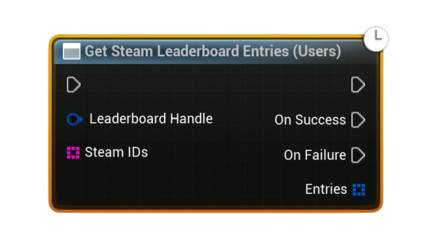

# Get Steam Leaderboard Entries (Users)

Asynchronously fetches leaderboard rows for a **specific list of Steam users** (by SteamID64). Returns entries only for users who have a score on this leaderboard.

#### Inputs
| `Pin` | `Type` | `Description` |
| --- | --- | --- |
| `Leaderboard Handle` | `FSAL_LeaderboardHandle` | Handle from **Find** or **Create** (must be valid). |
| `SteamIDs` | `String[]` | Array of SteamID64 strings (e.g., `7656119...`). Invalid IDs are skipped. Up to **100** users per call are processed. |

#### Outputs
| `Pin` | `Type` | `Description` |
| --- | --- | --- |
| `On Success` | `Exec` | Fired when rows are downloaded successfully. |
| `On Failure` | `Exec` | Fired on I/O failure, invalid handle, or if no valid users remain after parsing. |
| `Entries` *(On Success)* | `TArray<FSAL_LeaderboardEntryRow>` | Parsed rows for the provided users who have entries. |

<h3><b>Notes</b></h3>
<ul style="font-size:0.72rem; line-height:1.75">
  <li>Only users <b>with an existing score</b> on the leaderboard will return a row.</li>
  <li>Large lists are clamped internally (max ~<b>100</b> users per request). For more, batch your calls.</li>
  <li>Provide SteamID64 <b>as strings</b>; malformed IDs are ignored.</li>
</ul>
