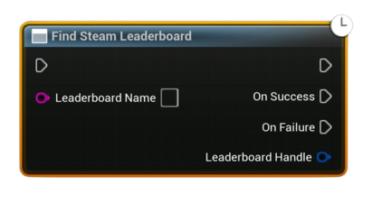

# Find Steam Leaderboard

Asynchronously finds an existing Steam leaderboard by its exact name and returns a reusable handle. Does <b>not</b> create a new leaderboard.

#### Inputs
| `Pin` | `Type` | `Description` |
| --- | --- | --- |
| `Leaderboard Name` | `String` | Exact name of the leaderboard to look up. |

#### Outputs
| `Pin` | `Type` | `Description` |
| --- | --- | --- |
| `On Success` | `Exec` | Fired when the Steam callback succeeds and a handle is returned. |
| `On Failure` | `Exec` | Fired if the leaderboard does not exist or on I/O failure. |
| `Leaderboard Handle` | `FSAL_LeaderboardHandle--` | Valid Leaderboard handle for subsequent upload/download calls. |

#### Notes

- The name must match exactly as configured in Steamworks. 
- Cache and reuse the returned <code>Handle</code> to avoid repeated lookups.

