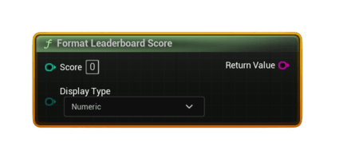

# Format Leaderboard Score

Formats a raw integer leaderboard score into a human‑readable display string based on the leaderboard’s <b>Display Type</b>.

#### Inputs
| `Pin` | `Type` | `Description` |
| --- | --- | --- |
| `Score` | `int32` | Raw score retrieved from leaderboard. |
| `Display Type` | `Enum` | Numeric, TimeSeconds, TimeMilliSeconds. |

#### Outputs
| `Pin` | `Type` | `Description` |
| --- | --- | --- |
| `Return Value` | `String` | The formatted score string. |

### Formatting Behavior
- **Numeric:**  
  `12345 → "12345"`
- **TimeSeconds:**  
  Interprets score as total seconds → `"MM:SS"`  
  Example: `123 → "02:03"`
- **TimeMilliSeconds:**  
  Interprets score as milliseconds → `"MM:SS.mmm"`  
  Example: `65432 → "01:05.432"`

### Usage
- Use this to produce consistent UI output for any leaderboard.
- Ideal for games with speedruns, time trials, or score‑based rankings.

### Notes
- If DisplayType is unsupported (should not happen), falls back to Numeric mode.
