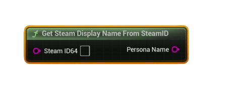

# Get Steam Display Name From SteamID

Resolves a player's <b>persona (display) name</b> from a SteamID64 string using the Steam Friends interface.

#### Inputs
| `Pin` | `Type` | `Description` |
| --- | --- | --- |
| `SteamID (String)` | `String` | A valid 17‑digit SteamID64 as a string. |

#### Outputs
| `Pin` | `Type` | `Description` |
| --- | --- | --- |
| `Persona Name` | `String` | The resolved nickname. Empty if Steam is unavailable or ID not found. |

### Usage
- Great for leaderboard UI when you only store SteamIDs.
- Automatically resolves names for downloaded leaderboard rows (useful fallback).

### Notes
- Steam overlay/friends must be available.
- Invalid or unknown IDs return an empty string.
