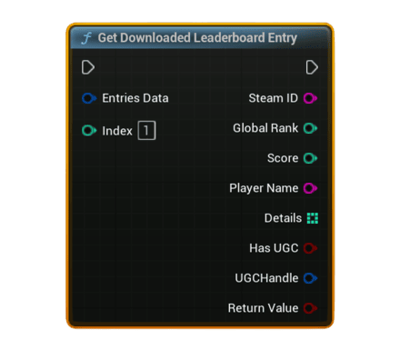

# Get Downloaded Leaderboard Entry

Reads a <b>single leaderboard row</b> from previously downloaded <code>Entries Data</code> at the given <b>Index</b>. Use this after calling <b>Download Steam Leaderboard Entries</b> or <b>Download Steam Leaderboard Entries (Users)</b>.

#### Inputs
| `Pin` | `Type` | `Description` |
| --- | --- | --- |
| `Entries Data` | `FSAL_LeaderboardEntriesData` | The container returned from **Download Steam Leaderboard Entries** / **Download Steam Leaderboard Entries (Users)**. Holds all rows and metadata. |
| `Index` | `int32` | Zero-based index into the internal entries array. Valid range is `0 .. EntryCount - 1`. |

#### Outputs
| `Pin` | `Type` | `Description` |
| --- | --- | --- |
| `SteamID` | `String` | The player's SteamID64 as a string (e.g., `7656119...`). |
| `Global Rank` | `int32` | 1-based global rank on this leaderboard. |
| `Score` | `int32` | Raw leaderboard score value. You can pass this to **Format Leaderboard Score** for display. |
| `Player Name` | `String` | The cached persona name at the time of download. May be empty if not available. |
| `Details` | `int32[]` | Optional per-entry integer details array that you uploaded with the score (may be empty). |
| `Has UGC` | `bool` | `true` if this entry has an attached UGC file handle; `false` otherwise. |
| `UGC Handle` | `FSAL_UGCHandle` | Steam UGC handle associated with this entry. Only valid when `Has UGC` is `true`. |
| `Return Value` | `bool` | `true` if the row was read successfully, `false` if `Entries Data` was empty or `Index` was out of range. |

<h3><b>Usage</b></h3>
<ul style="font-size:0.72rem; line-height:1.75">
  <li>Call <b>Download Steam Leaderboard Entries</b> (or <b>Download Steam Leaderboard Entries (Users)</b>) and store the returned <code>Entries Data</code> and <code>Entry Count</code>.</li>
  <li>Loop from <code>Index = 0 .. EntryCount - 1</code> and call <b>Get Downloaded Leaderboard Entry</b> each iteration.</li>
  <li>Use the outputs (<code>SteamID</code>, <code>Player Name</code>, <code>Global Rank</code>, <code>Score</code>, <code>Details</code>) to populate your UI widgets.</li>
  <li>If <code>Has UGC</code> is <b>true</b>, you can use <code>UGC Handle</code> together with your own UGC logic (e.g., downloading bytes and saving them with <b>Save Bytes To File</b>).</li>
</ul>

<h3><b>Notes</b></h3>
<ul style="font-size:0.72rem; line-height:1.75">
  <li>This node does <b>not</b> talk to Steam directly; it only reads from the cached <code>Entries Data</code> struct in memory.</li>
  <li>If <code>Entries Data</code> is empty, or <code>Index</code> is outside the valid range, the function logs a warning and returns <b>false</b>.</li>
  <li><code>Details</code> is copied from the stored row. If you never uploaded details for this leaderboard, the array will be empty.</li>
  <li><code>Has UGC</code> and <code>UGC Handle</code> are safe to read even on leaderboards without UGC; in that case <code>Has UGC = false</code> and the handle will be invalid.</li>
</ul>
