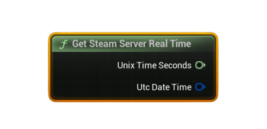

# Get Steam Server Real Time

Returns the current <b>Steam backend real time</b> as Unix seconds (int64) and as a <b>UTC FDateTime</b>. Useful for leaderboard timestamps, replay timelines, anti-cheat time checks, or syncing events with server time.

#### Outputs
| `Pin` | `Type` | `Description` |
| --- | --- | --- |
| `Unix Time Seconds` | `int64` | Seconds since 1970‑01‑01 UTC, sourced from Steam's backend clock. |
| `UTC DateTime` | `FDateTime` | Unreal-friendly UTC timestamp built from Steam's Unix time. |

### Usage
- Use this to timestamp UGC files, ghost runs, replay segments, or leaderboard submissions.
- Steam server time is authoritative — independent of local system clock.

### Notes
- If Steam is unavailable, both outputs return zero values.
- Online matchmaking or anti-cheat features often prefer server time for consistency.
