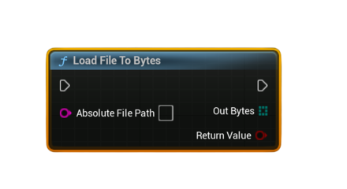

# Load File To Bytes

Loads the contents of a file on disk into a <b>byte array</b>. Required when preparing binary data to upload using <b>Upload Steam Leaderboard Score With UGC</b> or when loading saved UGC.

#### Inputs
| `Pin` | `Type` | `Description` |
| --- | --- | --- |
| `Absolute File Path` | `String` | Full path to the file on disk. Use project directory helpers to generate this path. |

#### Outputs
| `Pin` | `Type` | `Description` |
| --- | --- | --- |
| `Bytes` | `uint8[]` | File contents loaded into a byte array. |
| `Return Value` | `bool` | `true` if the file was successfully read, `false` otherwise. |

### Usage
- Common workflow for UGC uploads:  
  **Load File To Bytes → Upload Steam Leaderboard Score With UGC**
- Use for loading replay files, ghost data, JSON configs, binary files, images, or any custom data.

### Notes
- Path must be an **absolute path**.  
  Suggested pure nodes:  
  - **Get Project Directory**  
  - **Get Project Saved Directory**  
  - **Get Project Content Directory**
- If the file does not exist or cannot be read, the node returns `false` and the output byte array is empty.
- Often paired with **String To Bytes (UTF8)** or **Bytes To String (UTF8)** depending on the file type.
