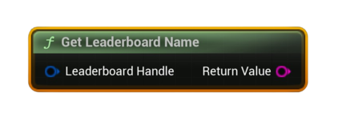

# Get Leaderboard Name

Returns the display name of the specified Steam leaderboard.

#### Inputs
| `Pin` | `Type` | `Description` |
| --- | --- | --- |
| `Leaderboard Handle` | `FSAL_LeaderboardHandle` | Handle obtained from **Find** or **Create** (must be valid). |

#### Outputs
| `Pin` | `Type` | `Description` |
| --- | --- | --- |
| `Name` | `String` | The leaderboard’s display name. |

<h3><b>Notes</b></h3>
<ul style="font-size:0.72rem; line-height:1.75">
  <li><b>Pure</b> node. Use for headers/UI labels.</li>
</ul>

