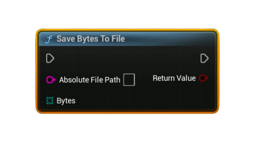

# Save Bytes To File

Saves a <b>byte array</b> to an <b>absolute file path</b> on disk. Useful for storing downloaded UGC payloads, replay files, ghost data, screenshots, or any binary data received from Steam.

#### Inputs
| `Pin` | `Type` | `Description` |
| --- | --- | --- |
| `Absolute File Path` | `String` | Full file path (e.g., `C:/MyGame/Saved/UGC/run.json`). Use pure nodes like <b>Get Project Directory</b> or <b>Get Project Content Directory</b> to build valid paths. |
| `Bytes` | `uint8[]` | Raw data to save. Must not be empty. |

#### Outputs
| `Pin` | `Type` | `Description` |
| --- | --- | --- |
| `Return Value` | `bool` | `true` if the file was successfully written, `false` otherwise. |

### Usage
- Common workflow:  
  **Download Steam UGC File → Save Bytes To File**  
- Use for saving replay files, ghost data, JSON configs, or any UGC data to disk.
- Combine with **Bytes To String (UTF8)** if you want to create a `.txt` or `.json` file.

### Notes
- If the directory does not exist, it is created automatically.
- The path should be an **absolute path**.  
  Use Unreal helpers like:  
  - **Get Project Directory**  
  - **Get Project Saved Directory**  
  - **Get Project Content Directory**
- If the byte array is empty or the file cannot be written, the node returns `false`.
