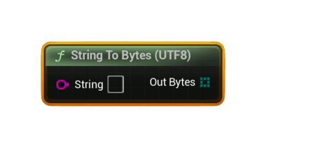

# String To Bytes (UTF8)

Converts a <b>String</b> into a <code>uint8[]</code> byte array encoded as <b>UTF‑8</b>. Required when preparing text/JSON payloads for <b>Upload Steam Leaderboard Score With UGC</b>.

#### Inputs
| `Pin` | `Type` | `Description` |
| --- | --- | --- |
| `String` | `String` | The input string to convert into raw UTF‑8 bytes. |

#### Outputs
| `Pin` | `Type` | `Description` |
| --- | --- | --- |
| `Bytes` | `uint8[]` | UTF‑8 encoded version of the string. |

### Usage
- Convert JSON, replay metadata, configuration text, or any textual content into bytes before sending it via UGC.
- Common workflow:  
  **String → String To Bytes (UTF8) → Upload Steam Leaderboard Score With UGC**

### Notes
- This is typically paired with **Bytes To String (UTF8)** after downloading a UGC file.
- Required for workflows involving UGC file upload/download.
