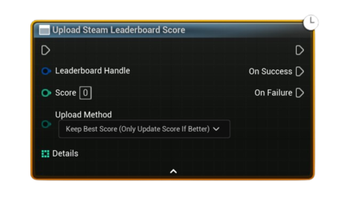

# Upload Steam Leaderboard Score

Asynchronously submits a score to a specific Steam leaderboard using the chosen upload method. Optionally includes `Details[]` (extra int32 metadata) stored with the entry.

#### Inputs
| `Pin` | `Type` | `Description` |
| --- | --- | --- |
| `Leaderboard Handle` | `FSAL_LeaderboardHandle` | Handle returned from **Find** or **Create**; must be valid. |
| `Score` | `int32` | The value to submit. (Display formatting—numeric/time—is defined by the leaderboard’s Display Type.) |
| `Upload Method` | `Enum (KeepBestScore / ForceUpdate)` | **KeepBestScore** only replaces the stored score if the new one is better per the Sort Method; **ForceUpdate** always overwrites. |
| `Details` *(optional)* | `int32[]` | Extra integers saved with the entry (e.g., laps, deaths, stage). Up to 64 values supported by Steam. |

#### Outputs
| `Pin` | `Type` | `Description` |
| --- | --- | --- |
| `On Success` | `Exec` | Fired after Steam confirms the upload. |
| `On Failure` | `Exec` | Fired on I/O failure or invalid parameters. |

<h3><b>Notes</b></h3>
<ul style="font-size:0.72rem; line-height:1.75">
  <li>Reuse the same <code>Leaderboard Handle</code> for subsequent downloads to verify the new score.</li>
  <li><b>KeepBestScore</b> respects the leaderboard’s <b>Sort Method</b> (Ascending for “faster is better” timeboards, Descending for “higher is better” pointboards).</li>
  <li><code>Details[]</code> are stored as 32-bit integers and can be retrieved later when downloading entries.</li>
</ul>
