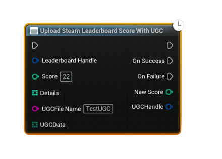

# Upload Steam Leaderboard Score With UGC

Uploads a leaderboard <b>score</b> and attaches a <b>UGC file</b> in a single async call. This is useful for sending complex data like replays, ghost runs, screenshots, JSON save blobs, or any other binary payload together with a score.

<ul style="font-size:0.72rem; line-height:1.75">
  <li><b>Important – Steam Cloud / Remote Storage:</b> UGC upload and download require Steam Cloud to be enabled for your app in Steamworks.</li>
  <li>In your app’s Steamworks settings, enable <b>Steam Cloud</b> and set:
    <ul>
      <li>a reasonable <b>Byte quota per user</b> (enough for your replay / ghost / save data), and</li>
      <li>a reasonable <b>Number of files allowed per user</b>.</li>
    </ul>
  </li>
  <li>If these values are <code>0</code> or too low, UGC operations may fail or be rejected, causing the UGC nodes to fire <b>On Failure</b>.</li>
</ul>

#### Inputs
| `Pin` | `Type` | `Description` |
| --- | --- | --- |
| `Leaderboard Handle` | `FSAL_LeaderboardHandle` | Valid handle obtained from <b>Find Steam Leaderboard</b> or <b>Create Steam Leaderboard</b>. |
| `Score` | `int32` | Score value to upload to this leaderboard. Uses the <b>Keep Best</b> method internally. |
| `Details` | `int32[]` | Optional per-score metadata array (same as in the normal upload node). Can be empty. |
| `UGC File Name` | `String` | File name to use in Steam Remote Storage for this UGC payload (no path, just the name). If left empty, a name like <code>SteamSAL_UGC_&lt;timestamp&gt;.json</code> is auto-generated. |
| `UGC Data` | `uint8[]` | Binary contents to write into the UGC file. Use helper nodes (e.g. <b>String To Bytes (UTF8)</b>) if you want to send text/JSON; or build your own binary format for replays/ghosts.</td> |

#### Outputs
| `Pin` | `Type` | `Description` |
| --- | --- | --- |
| `On Success` | `Exec` | Fired when the UGC file is written, shared, the score is uploaded, and the UGC handle is successfully attached. |
| `On Failure` | `Exec` | Fired if any step in the chain fails (invalid handle, empty data, Steam not available, file write failure, upload failure, etc.). |
| `New Score` *(On Success)* | `int32` | Final score value reported by Steam after upload (may differ if clamped or overridden by Steam). |
| `UGC Handle` *(On Success)* | `FSAL_UGCHandle` | Handle to the shared UGC file attached to this score. Use this later when resolving or downloading the UGC. |

<h3><b>What this node does internally</b></h3>
<ul style="font-size:0.72rem; line-height:1.75">
  <li>Writes <code>UGC Data</code> to <b>Steam Remote Storage</b> using the given <code>UGC File Name</code> (or an auto-generated one).</li>
  <li>Shares that file to obtain a Steam <b>UGC handle</b>.</li>
  <li>Uploads the leaderboard score using <b>Keep Best</b> as the upload method.</li>
  <li>Attaches the shared UGC handle to the uploaded score via <code>AttachLeaderboardUGC</code>.</li>
</ul>

<h3><b>Usage</b></h3>
<ul style="font-size:0.72rem; line-height:1.75">
  <li>Make sure Steam is available and you already resolved the <b>Leaderboard Handle</b> via <b>Find</b> or <b>Create</b>.</li>
  <li>Prepare your <code>UGC Data</code>:
    <ul>
      <li>For text/JSON: build a string and convert it to bytes with <b>String To Bytes (UTF8)</b>.</li>
      <li>For custom binary formats (replays, ghosts, etc.): serialize into a <code>uint8[]</code> however you prefer.</li>
    </ul>
  </li>
  <li>Call <b>Upload Steam Leaderboard Score With UGC</b> with:
    <ul>
      <li><code>Leaderboard Handle</code></li>
      <li><code>Score</code></li>
      <li>Optional <code>Details</code></li>
      <li>Optional <code>UGC File Name</code> (leave empty to auto-generate)</li>
      <li><code>UGC Data</code> (must not be empty)</li>
    </ul>
  </li>
  <li>On <b>Success</b>, store the returned <code>UGC Handle</code> together with the score or player data if needed, or rely on the handle exposed later through <b>Get Downloaded Leaderboard Entry</b>.</li>
</ul>

<h3><b>Notes</b></h3>
<ul style="font-size:0.72rem; line-height:1.75">
  <li>If <code>Leaderboard Handle</code> is invalid, or <code>UGC Data</code> is empty, the node fails immediately with an explanatory error message.</li>
  <li>The node requires both <b>Steam Remote Storage</b> and <b>Steam User Stats</b> to be available; otherwise it will fire <b>On Failure</b>.</li>
  <li>Cloud status and quota are logged to the output log for easier debugging (account/app enabled state and space usage).</li>
  <li>The UGC file is stored in Steam Cloud bound to your AppID. Make sure Steam Cloud is enabled in your Steamworks settings if you plan to rely on this.</li>
  <li>Later, when you download leaderboard rows, you can check <b>Has UGC</b> and read the associated <b>UGC Handle</b> from <b>Get Downloaded Leaderboard Entry</b> to find and download the attached payload.</li>
</ul>
