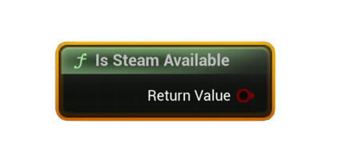

# Is Steam Available

Checks whether Steam is properly initialized for this session and ready for API calls.

#### Inputs
| `Pin` | `Type` | `Description` |
| --- | --- | --- |
| *(Hidden)* World Context | `UObject` | World context (auto-filled in most Blueprint graphs). |

#### Outputs
| `Pin` | `Type` | `Description` |
| --- | --- | --- |
| `Available` | `Bool` | `true` if Steam interfaces are valid and the user is logged in. |

<h3><b>Notes</b></h3>
<ul style="font-size:0.72rem; line-height:1.75">
  <li><b>Pure</b> node (no async work).</li>
  <li>Returns <code>true</code> when:
    <ul>
      <li>Steam interfaces exist (<code>SteamUser</code>, <code>SteamUserStats</code>, <code>SteamUtils</code>),</li>
      <li>AppID is non-zero, and</li>
      <li>The user is <b>logged on</b> to Steam.</li>
    </ul>
  </li>
  <li>Use this at startup to gate leaderboard/achievement calls and show helpful UI if Steam isn’t active.</li>
</ul>
